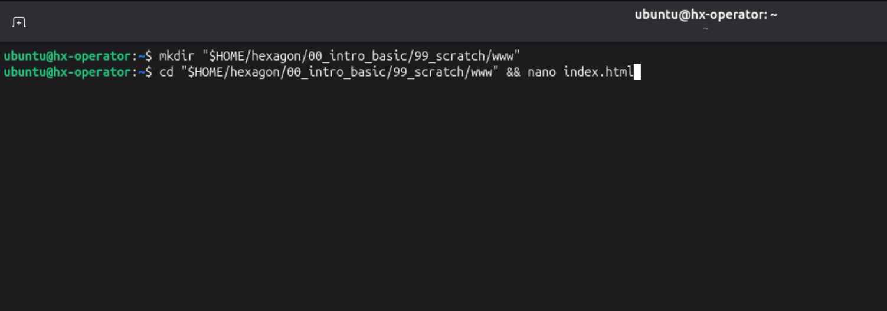
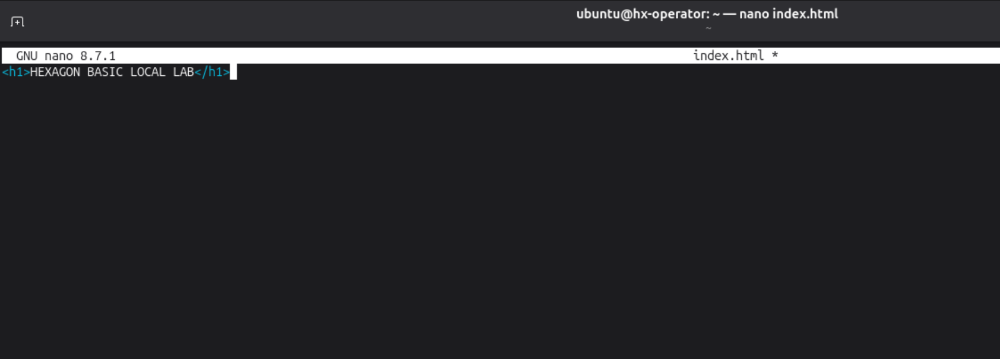
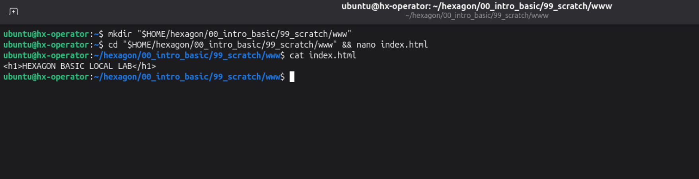
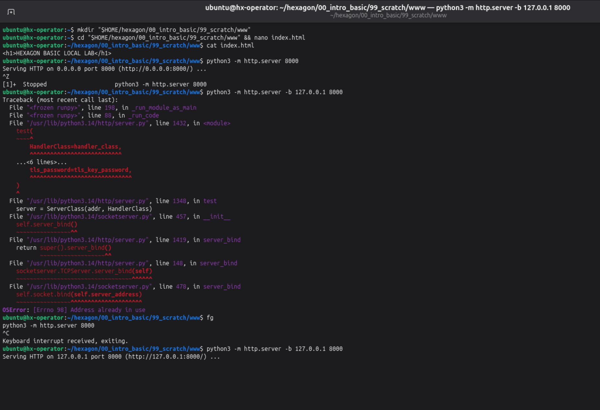
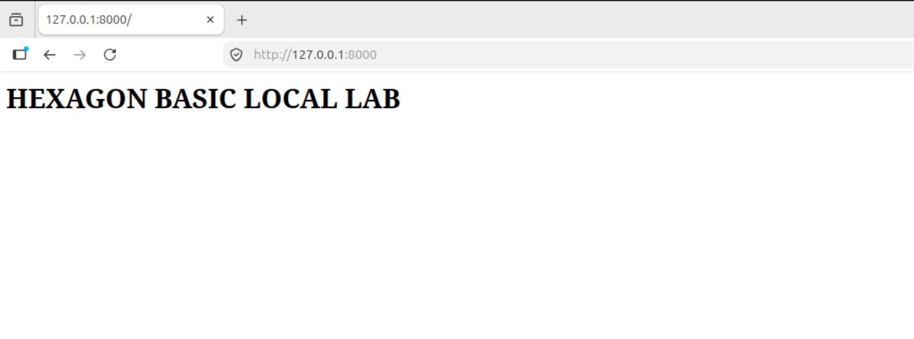
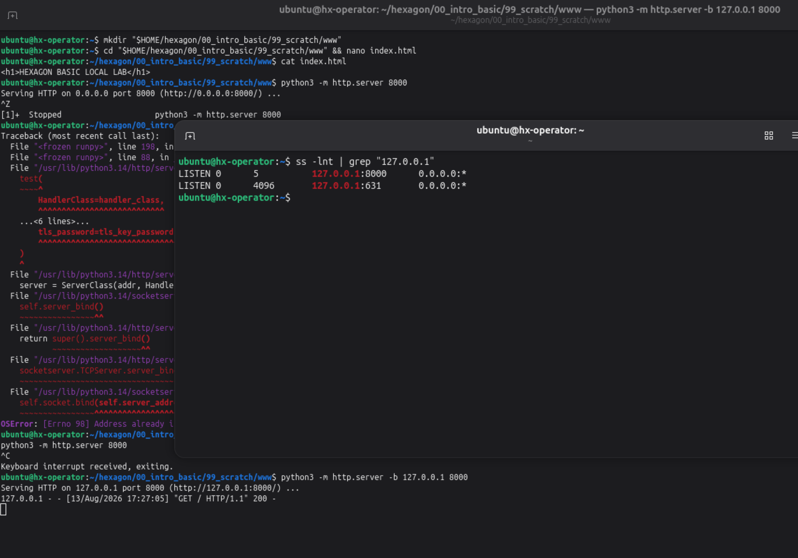
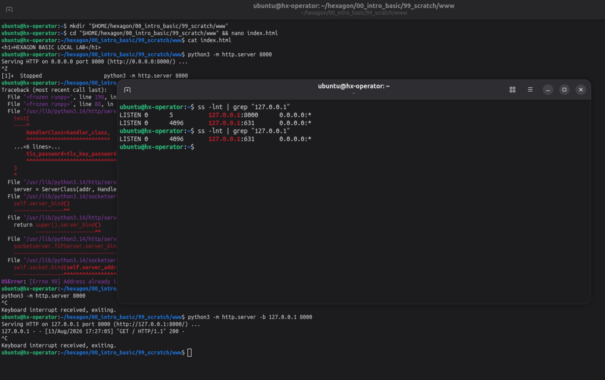

# 00 — Basic Local Service Lab

> **Status:** Attempt 01 — Incomplete Independent Validation  
> **Environment:** Ubuntu Operator VM (`hx-operator`)  
> **Scope:** IPv4 Loopback Only (`127.0.0.1`)  
> **Service:** Python `http.server`  
> **Port:** `8000`  
> **Date:** 2026-08-13  
> **Learning Path:** HEXAGON Red Team Lab — Basic Foundations

---

## Overview

This repository documents my first end-to-end technical lab in the HEXAGON Red Team learning path.

The exercise was designed to test whether I could create a controlled local service, observe its runtime state, validate its network listener, confirm application-level reachability, terminate the service, and then verify that the listener disappeared.

Attempt 01 was **not an independent pass**.

I completed several parts of the lab successfully, but I also required assistance with exact command syntax, made an incorrect process-control decision, and did not complete the full validation chain required by the original exercise.

Those failures are intentionally preserved rather than rewritten as a successful run.

I am keeping this attempt as a baseline for future comparison. The purpose of this repository is not to present an artificially clean learning history, but to document where my practical skills actually were at this point, what failed under pressure, what I understood, and what still needs to improve before I can consider the same objective independently validated.

---

## Lab Objective

The objective of this lab was to build and validate a small local HTTP service entirely on the Ubuntu Operator VM.

The exercise required me to create controlled HTML content, serve it through a Python HTTP process, restrict the service to the IPv4 loopback address `127.0.0.1`, and verify that a TCP listener existed on port `8000`.

The intended validation covered the complete service lifecycle:

- create controlled content;
- start the service;
- restrict its network exposure;
- confirm the TCP listener;
- validate the HTTP response;
- terminate the process;
- verify that the listener disappeared.

No external target, remote host, or out-of-scope network interaction was required.

### Intended Execution Chain

```text
Controlled HTML file
        ↓
Python HTTP process
        ↓
TCP listening socket
        ↓
127.0.0.1:8000
        ↓
HTTP response
        ↓
Process termination
        ↓
Listener no longer present
```

---

## Scope and Environment

| Item | Value |
|---|---|
| Host | `hx-operator` |
| Operating System | Ubuntu Linux |
| Network Scope | `127.0.0.1` only |
| Protocol | HTTP over TCP |
| Service | Python `http.server` |
| Port | `8000` |
| Web Root | `$HOME/hexagon/00_intro_basic/99_scratch/www` |
| External Target | None |
| Elevated Privileges Required | No |

The lab was intentionally restricted to the local loopback interface so that the entire exercise remained contained within the Operator VM.

No external target or remote system was involved because the objective was to understand and validate the lifecycle of a local service rather than interact with another host.

Elevated privileges were not required because all files, processes, and network activity used in the lab remained within resources available to the normal user account.

---

## Evidence Provenance

The screenshots included in this repository were reproduced after the original attempt in order to document the same states, mistakes, and recovery sequence more clearly.

They are **not presented as evidence of a clean second independent attempt**.

The reconstruction does not change the assessment of Attempt 01. The original attempt required assistance and remained incomplete.

This distinction is important to me because the purpose of this repository is to preserve the real learning state, not to replace an imperfect first attempt with cleaner evidence afterward.

---

# Execution

## Step 1 — Preparing the Local Web Root

I created a dedicated `www` directory inside the existing HEXAGON scratch area:

```text
$HOME/hexagon/00_intro_basic/99_scratch/www
```

This directory served as the local web root for the lab.

Keeping the files inside the existing scratch area provided a clear and controlled location for the exercise without modifying unrelated parts of the system.

### Evidence 01 — Web Root Creation



Evidence 01 shows the creation of the dedicated `www` directory and the transition into that location before creating `index.html`.

The important point is not the individual filesystem commands themselves, but that the lab began inside the intended controlled working location.

---

## Step 2 — Creating Controlled HTML Content

Inside the web root, I created an `index.html` file containing a deliberately simple and recognizable marker:

```html
<h1>HEXAGON BASIC LOCAL LAB</h1>
```

The purpose of using known content was to give the later HTTP validation a deterministic expected result.

Instead of merely checking whether "something" was returned by the server, I would know exactly what content should be served.

### Evidence 02 — HTML Marker Creation



Evidence 02 shows the controlled marker being written to `index.html` in the terminal editor.

### Evidence 03 — HTML Content Verification



Before starting the service, I verified the file contents from the terminal.

The output confirmed that the expected marker existed locally before HTTP was introduced into the validation chain.

This separated two questions:

1. Does the file contain the expected content?
2. Can the HTTP service later return that content?

---

## Step 3 — Initial HTTP Service Start

I already had previous exposure to the basic Python HTTP server syntax and knew how to start a service on a chosen port:

```text
python3 -m http.server 8000
```

The process started successfully.

However, the output immediately showed:

```text
Serving HTTP on 0.0.0.0 port 8000
```

The required state for this lab was:

```text
127.0.0.1:8000
```

The service was therefore running, but it was **not running with the intended network scope**.

This was an important distinction.

A successful process start is evidence that a process started. It is not evidence that the process started with the correct configuration.

### Required State

```text
127.0.0.1:8000
```

### Initial Observed State

```text
0.0.0.0:8000
```

The initial bind was broader than required by the lab.

The objective was specifically to expose the service only through the IPv4 loopback interface. Seeing `0.0.0.0` meant I needed to correct the configuration rather than treat successful startup as sufficient evidence.

---

## Step 4 — Bind Troubleshooting

I knew how to start `python3 -m http.server`, but I did not know the exact syntax required to bind the service to a specific address.

My first mental model treated the address and port too much like a browser endpoint, where an IP address and port are commonly written together.

That model did not match the command-line interface used by Python's HTTP server.

The resulting errors were useful because they showed that my assumption was wrong.

Instead of continuing to guess indefinitely, I inspected the tool's built-in help and found:

```text
-b, --bind ADDRESS
```

This clarified the command structure:

```text
ADDRESS → bind option argument
PORT    → separate positional argument
```

The correct model was therefore not:

```text
127.0.0.1:8000
```

as one command-line value.

It was a bind address plus a separate port.

### Bind Option Discovered During Troubleshooting

```text
-b, --bind ADDRESS
```

The larger lesson was not simply memorizing `-b`.

The more important lesson was that once my syntax model stopped matching the program's behavior, the tool's own documentation was more reliable than continuing to invent command forms.

---

## Step 5 — Process-Control Failure and Recovery

During the troubleshooting process, I made another mistake.

I intended to stop the original Python server, but I pressed:

```text
Ctrl+Z
```

At that point I did not have a stable practical understanding of the difference between suspending and terminating a foreground process.

The shell reported the job as:

```text
Stopped
```

I initially treated that state too much like "the server is gone."

It was not.

The process had been suspended rather than terminated.

When I attempted to start another server using the same port, Python returned:

```text
OSError: [Errno 98] Address already in use
```

That failure exposed the consequence of the earlier mistake.

The original process still existed.

### Process-Control Model Exposed by the Failure

```text
Ctrl+Z
    ↓
Suspend foreground job

fg
    ↓
Return suspended job to foreground

Ctrl+C
    ↓
Send an interrupt to the foreground process
    ↓
Python http.server exits
```

I then learned about:

```text
fg
```

This command was new to me and was not intuitive during Attempt 01.

Using `fg` returned the suspended Python process to the foreground. I could then use `Ctrl+C`, after which Python reported:

```text
Keyboard interrupt received, exiting.
```

Only after that recovery could I start a new HTTP server using the intended loopback-only configuration.

### Evidence 04 — Server Troubleshooting and Recovery



Evidence 04 preserves the most important troubleshooting sequence from the lab.

It shows:

- the initial server running on `0.0.0.0:8000`;
- `Ctrl+Z` suspending the process;
- a new bind attempt failing with `Address already in use`;
- `fg` restoring the suspended job to the foreground;
- `Ctrl+C` terminating the original Python server;
- the final server successfully binding to `127.0.0.1:8000`.

I am intentionally keeping this screenshot rather than replacing it with a cleaner terminal because the failure chain is part of the technical evidence.

---

## Step 6 — Successful Loopback-Only Service

After terminating the original process and correcting the bind syntax, the server started successfully with the required local-only configuration.

The observed endpoint was:

```text
http://127.0.0.1:8000
```

The Python process remained in the foreground while serving the local content.

This state matched the intended scope of the lab:

```text
127.0.0.1
```

was the listening address, and:

```text
8000
```

was the selected TCP port.

---

## Step 7 — Browser-Level HTTP Validation

I opened the service from the same Operator VM using:

```text
http://127.0.0.1:8000
```

The browser rendered:

```text
HEXAGON BASIC LOCAL LAB
```

This demonstrated that the local HTTP service was reachable and that the controlled HTML content could be retrieved through it.

### Evidence 05 — Browser Validation



Evidence 05 confirms that the expected controlled marker was rendered through the local HTTP service at `127.0.0.1:8000`.

However, browser rendering alone was not the complete validation chain required by the original exercise.

It demonstrated application-level reachability, but additional terminal-level HTTP validation was still expected.

### Server-Side Request Observation

The Python server terminal also recorded the browser request:

```text
GET / HTTP/1.1
200
```

This added a second perspective to the same interaction.

The browser showed that content was received.

The server-side output showed that the Python HTTP process observed the request and returned an HTTP `200` response.

This was useful evidence, but it still did not replace the explicit terminal-based HTTP header and response-body checks required by the original lab.

---

## Step 8 — TCP Listener Validation

The next objective was to validate the service at the socket level rather than relying only on the browser.

I independently recognized that `ss` was the relevant tool for inspecting local socket state.

That part of the reasoning was present.

The exact option combination was not.

### Tool Recognition

I knew that I needed:

```text
ss
```

but I could not independently reconstruct:

```text
-lnt
```

during the attempt.

### Exact Syntax Recall Failure

```text
-l → listening
-n → numeric
-t → TCP
```

This distinction matters.

Recognizing the correct tool and recalling the exact syntax are different skills.

During Attempt 01:

```text
Tool recognition:      present
Exact syntax recall:   not stable
Independent execution: not demonstrated
```

I required assistance to recover the exact option combination.

I therefore do not consider this part of the attempt independently completed.

### Evidence 06 — TCP Listener Present



Evidence 06 shows:

```text
127.0.0.1:8000
```

in the `LISTEN` state.

This is operating-system-level evidence that a TCP listener existed on the expected loopback address and port.

The same filtered output also contained:

```text
127.0.0.1:631
```

which was an unrelated pre-existing local listener.

That actually made the later comparison more useful: the goal was not to make every loopback listener disappear, but specifically to observe the lifecycle of the lab-created listener on port `8000`.

The Python terminal visible behind the socket inspection also shows the successful browser request and HTTP `200` response.

---

## Step 9 — Process Termination

After observing the active listener, I intentionally returned to the terminal running the Python HTTP process and used:

```text
Ctrl+C
```

This time the action was deliberate.

Unlike the earlier `Ctrl+Z` mistake, the goal was not to suspend the job but to interrupt the foreground Python process and allow the HTTP server to exit.

Python reported:

```text
Keyboard interrupt received, exiting.
```

The process was no longer serving the local content.

The next question was not:

> "I stopped it, so the socket must be gone."

The next question was:

> "Can I independently observe that the socket is gone?"

---

## Step 10 — Listener Closure Validation

I repeated the socket inspection after terminating the server.

Before termination, the output contained:

```text
127.0.0.1:8000 → LISTEN
```

After termination, the `8000` listener was no longer present.

The unrelated local listener on port `631` remained visible.

### Before Process Termination

```text
127.0.0.1:8000 → LISTEN
127.0.0.1:631  → LISTEN
```

### After Process Termination

```text
127.0.0.1:631  → LISTEN
127.0.0.1:8000 → NOT PRESENT
```

This before/after comparison gave me a much clearer mental model of the relationship between a running process and its listening socket.

The server process existed and the listener was present.

The server process exited and the listener disappeared.

### Evidence 07 — Listener Lifecycle



Evidence 07 captures the final lifecycle comparison.

The first socket inspection contains `127.0.0.1:8000`.

After the Python process is terminated, the repeated inspection no longer contains port `8000`.

The unrelated `127.0.0.1:631` listener remains, which helps isolate the specific state change produced by terminating the lab service.

---

# Failure Analysis

## Failure 01 — Initial Network Exposure Was Broader Than Intended

### Expected

```text
127.0.0.1:8000
```

### Observed

```text
0.0.0.0:8000
```

The first Python process started successfully, but successful startup was not the actual success criterion.

The service was required to remain restricted to the local loopback interface.

The mistake exposed an important operational habit:

**configuration must be validated after execution rather than inferred from the absence of an error.**

A command returning no obvious failure does not automatically mean that the resulting state matches the objective.

---

## Failure 02 — Bind Syntax Was Not Known

I did not know the exact Python HTTP server bind syntax before reaching this stage.

My initial attempts were based on an incorrect command-line model.

The errors were not meaningless failures. They revealed that Python's argument parser was interpreting my input differently from the way I expected.

The built-in help then provided the missing structure:

```text
-b, --bind ADDRESS
```

### Lesson

The important lesson was not simply:

> remember `-b`.

The more durable lesson was:

> when my mental model and the program's behavior disagree, stop guessing and interrogate the tool itself.

Exact syntax can be recovered.

A bad troubleshooting habit can follow me into every future tool if I do not correct it.

---

## Failure 03 — The Process Was Suspended Instead of Terminated

### Intended Action

Stop the Python HTTP server so that I could restart it with the correct bind configuration.

### Actual Action

I pressed:

```text
Ctrl+Z
```

which suspended the foreground process.

### Consequence

The process still existed.

When I attempted to use the same port again, Python returned:

```text
Address already in use
```

The error was a direct consequence of my misunderstanding of the process state.

### Recovery

I used:

```text
fg
```

to return the suspended job to the foreground.

I then used:

```text
Ctrl+C
```

and Python exited.

### Lesson

The word `Stopped` in shell job control did not mean what I initially assumed.

A process can be stopped in the sense of being **suspended** without being terminated.

This failure turned process state from an abstract concept into something observable with an immediate consequence.

---

## Failure 04 — Exact `ss -lnt` Syntax Was Not Retained

I independently remembered that `ss` was the relevant tool for local socket inspection.

I did **not** independently remember the exact:

```text
-lnt
```

option combination.

I required assistance to recover it.

That means I cannot honestly classify socket inspection during Attempt 01 as independent execution.

I am deliberately preserving that distinction.

A later successful execution after seeing the syntax would not retroactively change what happened during the original attempt.

### Current State

| Skill | Assessment |
|---|---|
| Recognizing `ss` as the relevant tool | Present |
| Recalling `-lnt` independently | Not stable |
| Understanding the listener evidence | Functional in session |
| Recovering syntax through documentation | Needs reinforcement |

This is not a statement that I must permanently memorize every flag before I can progress.

It is a statement that, when exact syntax was missing, my fallback process was not yet reliable enough.

---

## Failure 05 — Documentation Was Not the First Reflex

One of the most important weaknesses exposed by this lab was not a Linux command.

It was my reaction when a command disappeared from memory.

My first instinct was still too close to:

```text
guess → try → guess again
```

instead of:

```text
unknown syntax
      ↓
stop guessing
      ↓
read the error
      ↓
use --help / -h / man
      ↓
build a hypothesis
      ↓
test
      ↓
validate
```

I successfully used built-in help during the Python bind troubleshooting, but that documentation-first behavior was not yet automatic when I later became blocked on `ss`.

### Desired Troubleshooting Pattern

```text
Unknown syntax
      ↓
Stop guessing
      ↓
Read error output
      ↓
Use --help / -h / man
      ↓
Form hypothesis
      ↓
Test
      ↓
Validate
```

### Lesson

Professional command-line work is not a memory contest.

Knowing what a tool does, understanding the state I need to inspect, and knowing how to recover exact syntax safely are more valuable than pretending that every option will always be available from memory.

The weakness exposed here was not simply that I forgot three letters.

The weakness was that my recovery mechanism was not yet automatic.

---

## Failure 06 — Original Validation Chain Was Incomplete

The lab produced useful evidence:

- the controlled HTML file existed;
- the Python service successfully bound to `127.0.0.1:8000`;
- the browser returned the expected marker;
- the server observed a `GET` request and returned HTTP `200`;
- the operating system showed a TCP listener on `127.0.0.1:8000`;
- the listener disappeared after the Python process terminated.

However, the original exercise required additional explicit terminal-level validation that was not completed during Attempt 01.

### Missing Validation Evidence

- [ ] Explicit terminal HTTP header validation
- [ ] Explicit terminal HTTP response-body validation
- [ ] Explicit post-stop validation of the expected no-match exit status

These missing checks matter because the lab was designed around an evidence chain, not around reaching a page in a browser and declaring success.

The evidence I did collect remains valid.

But valid partial evidence does not become complete evidence simply because the overall result looked correct.

That is one of the reasons Attempt 01 remains incomplete.

---

# What Worked

Several parts of the exercise did work and should not be erased simply because the overall attempt did not pass independently.

I was able to:

- establish the intended local working area;
- create and verify controlled HTML content;
- use existing familiarity with Python's basic HTTP server;
- notice that the initial `0.0.0.0` bind did not match the required scope;
- use program output and built-in help to correct the bind model;
- recover from a suspended foreground process;
- successfully restrict the service to `127.0.0.1:8000`;
- validate the expected page through the browser;
- recognize `ss` as the relevant socket-inspection tool;
- observe the expected TCP listener;
- intentionally terminate the Python process;
- compare socket state before and after termination.

The attempt therefore was not "nothing worked."

It was a partially successful execution that exposed several very specific weaknesses.

That distinction is important.

---

# What Did Not Work

The main weaknesses exposed during Attempt 01 were:

- exact command syntax was not reliably retrievable under pressure;
- shell job-control behavior was not sufficiently understood before the failure occurred;
- `fg` was new and not intuitively available as a recovery mechanism;
- documentation was not always my first fallback when recall failed;
- the complete HTTP validation chain was not finished;
- assistance was required during a stage that was supposed to be independently reconstructed.

These are now concrete problems that can be tested again later.

Before the lab, some of them were only invisible gaps.

---

# What I Understood Conceptually

Despite the incomplete independent execution, the lab improved several mental models.

I now have a clearer distinction between:

```text
process
socket/listener
IP address
port
application response
process state
```

I also understand more clearly that:

- a running process and a listening socket are related but are not the same thing;
- an IP address and a port identify different parts of an endpoint;
- binding to `127.0.0.1` intentionally restricts the service to the local machine;
- `Ctrl+Z` and `Ctrl+C` produce fundamentally different process states;
- successful command execution does not automatically mean correct configuration;
- an observation is stronger when it can be independently verified;
- before/after state comparison can expose causality much more clearly than a single screenshot.

### Lifecycle Model

```text
process starts
      ↓
listener appears
      ↓
application becomes reachable
      ↓
process terminates
      ↓
listener disappears
```

The part that became especially clear to me was the relationship between the process and the listener.

I did not merely read that relationship in documentation.

I observed the listener while the Python process was running, terminated the process, and then observed that the lab-created listener was no longer present.

That made the lifecycle concrete.

---

# Knowledge Gaps Exposed

| Area | Current State | Notes |
|---|---|---|
| Python HTTP server basics | Functional | Basic server startup was already familiar |
| Loopback bind syntax | First practical exposure | Required help/documentation during Attempt 01 |
| Shell job control | Partial | Suspension vs termination became clearer through failure |
| `fg` recall | Not stable | New command during this attempt |
| `ss` tool recognition | Present | Correct tool was independently identified |
| `ss -lnt` recall | Not stable | Exact flags required assistance |
| Documentation fallback | Developing | Used successfully for Python, not yet automatic everywhere |
| HTTP validation chain | Incomplete | Required terminal header/body checks were skipped |
| Process → listener lifecycle | Functional in session | Before/after state was successfully observed |

These states are intentionally conservative.

I would rather underestimate my current command fluency than label something "learned" simply because I successfully executed it once.

---

# Evidence Summary

| Evidence | Purpose | Result |
|---|---|---|
| `01-web-root.png` | Web-root creation | Dedicated lab web root established |
| `02-html-marker.png` | Controlled HTML marker creation | Expected marker written to `index.html` |
| `03-html-verification.png` | Local content verification | Expected marker confirmed before service start |
| `04-server-troubleshooting.png` | Bind and process-control troubleshooting | Failure, recovery, and final loopback bind documented |
| `05-browser-validation.png` | Browser-level HTTP validation | Expected marker rendered from `127.0.0.1:8000` |
| `06-listener-present.png` | TCP listener validation | `127.0.0.1:8000` observed in `LISTEN` state |
| `07-listener-closure.png` | Before/after listener lifecycle | Port `8000` listener disappeared after process termination |

---

# Attempt 01 Assessment

### Result

```text
Attempt 01
Status: NOT AN INDEPENDENT PASS
```

Attempt 01 achieved several technical objectives, but it did not meet the standard required for independent completion.

The local content was created.

The service was eventually restricted to the correct loopback address.

The page was reachable.

The TCP listener was observed.

The listener disappeared after the server process terminated.

However:

- critical syntax required assistance;
- process-control knowledge was incomplete;
- documentation fallback was inconsistent;
- required HTTP validation steps were skipped;
- the final validation chain was therefore incomplete.

For those reasons, I will not label this attempt as a pass.

It remains my initial practical baseline.

---

# Why I Am Keeping the Failed Attempt

I could have waited until I could reproduce the entire exercise cleanly and then published only the successful version.

I deliberately chose not to do that.

If the first thing visible in this repository were a polished success, it would hide the most important information about where my practical development actually began.

This attempt exposed weaknesses that were easy to miss while reading, discussing commands, or following guided exercises.

Under a complete end-to-end objective, recall failed.

A process-control mistake created a second problem.

A missing documentation reflex became visible.

Parts of the validation chain were skipped.

That is real information.

I want future successful attempts to stand **next to this one**, not overwrite it.

If my skills improve, the difference should be visible in the history.

The goal is not to create the appearance that I never struggled.

The goal is to create evidence that the things I struggled with eventually became skills I could execute, explain, and validate independently.

---

# What This Failure Changed

Before this lab, it was easy to think about knowledge mainly in terms of whether I recognized a command or understood an explanation.

The lab exposed a harder standard.

Recognition is not the same as retrieval.

Retrieval is not the same as execution.

Execution is not the same as validation.

And successful output is not automatically proof that the intended state was achieved.

The experience also changed how I think about command memorization.

I still want important commands and patterns to become familiar, but I do not want my workflow to depend on perfect recall.

A professional fallback must exist:

```text
understand the objective
        ↓
identify the relevant tool
        ↓
recover exact syntax when necessary
        ↓
execute deliberately
        ↓
inspect evidence
        ↓
verify the resulting state
```

The failure gave me something a clean first attempt would not have given me:

a precise map of what still breaks when I have to assemble the pieces myself.

---

# Cold Revalidation

> **Status:** Pending

Attempt 01 will not be immediately repeated and then reclassified as proof of independent retention.

An immediate repetition would be heavily influenced by short-term memory of the same commands, mistakes, and corrections.

A future cold revalidation will therefore be performed after temporal distance and may use different concrete values while preserving the same underlying technical objective.

The goal will not be to memorize the Attempt 01 sequence.

The goal will be to reconstruct the workflow from understanding.

## Allowed Resources

- `--help`
- `-h`
- `man`
- command error output
- local system documentation
- independent reasoning

Using documentation will **not** count as failure.

The objective is not to prove photographic memory.

The objective is to prove that I can identify what I need, recover exact syntax professionally when necessary, execute the workflow, understand the resulting state, and build the required evidence chain.

## Not Allowed

- direct command-by-command hints from an external assistant;
- copying the Attempt 01 sequence as a prepared script;
- silently replacing Attempt 01 with cleaner evidence;
- treating a warm reconstruction as delayed retention.

---

# Cold Revalidation Success Criteria

A future attempt will qualify as an independent pass only if I can:

- [ ] Create controlled local content
- [ ] Start the intended local service
- [ ] Restrict the service to the intended local address
- [ ] Verify the TCP listener
- [ ] Validate the HTTP headers
- [ ] Validate the expected HTTP response body
- [ ] Terminate the process intentionally
- [ ] Verify that the lab-created listener disappears
- [ ] Validate the expected post-stop no-match result
- [ ] Recover unknown syntax through documentation when necessary
- [ ] Explain what each major observation proves
- [ ] Explain what each observation does **not** prove
- [ ] Complete the validation without direct command hints

I will consider the lab independently passed only when I can reconstruct the evidence chain myself rather than reproduce a memorized command sequence.

---

# Operator Reflection

This lab mattered to me because it was the first point in the learning path where several previously separate Linux concepts had to work together as one sequence.

Filesystem state.

Process state.

Network binding.

Socket inspection.

HTTP validation.

Termination.

Evidence.

Individually, none of those ideas seemed impossible.

The difficulty appeared when I had to connect them without being carried through every step.

My first reaction to that failure was frustration.

But after looking at what actually happened, I realized that the failed attempt was more useful than an easy success would have been.

It exposed the exact places where recognition had not yet become operational skill.

It showed me that I could understand a concept and still fail to retrieve its syntax.

It showed me that a small process-control mistake could create a second technical problem.

It showed me that knowing a tool exists is not enough if I do not yet have a reliable strategy for recovering the command I need.

And it showed me why evidence matters.

I do not want this repository to pretend that development is a straight line from lesson to success.

This is the real line.

Some parts worked.

Some parts failed.

Some parts required help.

Some concepts became clearer because they failed in front of me.

That is the state I want documented.

---

# Final Status

| Field | State |
|---|---|
| Lab | `00 — Basic Local Service Lab` |
| Attempt | `01` |
| Independent | **No** |
| Complete | **No** |
| Documented | **Yes** |
| Cold Revalidation | **Pending** |

Attempt 01 remains incomplete.

That status is intentional.

The value of this repository is not that the first attempt looks impressive. Its value is that the record is accurate enough for a future attempt to demonstrate measurable improvement.

---

## Repository Integrity Note

Attempt 01 will not be rewritten after future improvement.

The mistakes, assistance boundaries, incomplete validation steps, and documented weaknesses will remain part of the record.

A future successful attempt will be added separately.

The purpose of this repository is to preserve development history rather than manufacture a version of that history in which every attempt succeeded.

---

**HEXAGON Red Team Lab — Operator Development Record**
